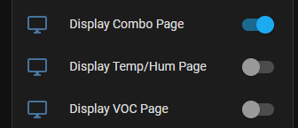
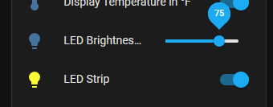

# AirGradient ESPHome Configurations

ESPHome yaml files for AirGradient devices to maintain the research and accuracy of AirGradient sensors, while also gaining the benefits of ESPHome/HomeAssistant for easy to use switches, buttons, configurations, and dashboards.  Maintains the ability to also send data to the AirGradient Dashboard, which can also be disabled/removed to keep all data local.

## Breaking Changes

Due to renaming of the Automatic Background Calibration switch to the proper name of Automatic Baseline Correction, this switch will default to being enabled, even if previously you had disabled it.  After installing, disable again if desired

## Changes

* Added Display Contrast slider to dim the display
* Added device_class to the PMSx005 sensors to have them properly reflect in the HomeKit integration if supported ([Forum Link](https://forum.airgradient.com/t/airgradient-one-customized-mallocarray-esphome-display/1328/7?u=mallocarray))
* Added optional Factory Reset switch that is disabled by default. Can be enabled in HomeAssistant and used if desired
* LED combo package. Left 5 LEDs reflect CO2 levels, middle 5 LEDs reflect PM2.5 levels, far right indicates VOC. (Same as display)
* LED bar configs feature a "LED Fade" parameter that controls the percentage that the LED bar dims out from the center
  
* CO2 package supports optional substitution `co2_offset` to offset reported readings by a set amount.  Useful if sensor is known to be off by a certain amount, or if wanting to override default calibration of 400 ppm

## Features

Many added features can be found in HomeAssistant by going to Settings>Devices and selecting the AirGradient device.  Alternatively, add `web_server:` to the config file to enable a built-in web server on the AirGradient device (No recommended for devices based on the D1 Mini ESP8266)

- Compact single page display by default with all relevant sensor readings
- Display Contrast slider to dim the display
- Enable different pages of information to be shown on the OLED display, or leave the default of a single page with all relevant information

  
- Button to initiate a SenseAir S8 CO2 Calibration on demand

  
- Switch to enable or disable SenseAir S8 CO2 sensor Automatic Baseline Calibration (ABC)

  
- Button to view the current S8 ABC interval (confirm if ABC is disabled or enable, which defaults to every 7 days) View ESPHome logs to see the output of this button

  
- Switch to disable LED output on AirGradient ONE model
- Brightness slider to adjust intensity of AirGradient ONE LED

  
- Switch to toggle display between Fahrenheit and Celsius and persist between reboots

  
- Switch to enable or disable uploading to AirGradient Dashboard via API (Choose to keep data local or also send to AirGradient)

  
- Utilize hardware configuration buttons on AirGradient Pro v3.7 and higher

  - Short press (Less than 1 second) - Toggle between F and C on display
  - Long press (More than 1 second, less than 5) - Trigger manual CO2 calibration
- Leverage automations in HomeAssistant to turn on the "Blank" page and turn off all other pages to effectively disable the display output.  Could also turn off the LED strip or set Brightness to 0 to eliminate output while still collecting sensor data

## Installation

### Standard

* In ESPHome web interface, click New Device.  Give any name. Select any model of board, and click Skip on the final page to not install at this time. Click Edit on the new entry and replace with the contents of the .yaml file for your model.
* Alternatively, copy the .yaml file from the main folder for your model in this repo and place it in the `config` folder of your ESPHome.
* Make any desired changes to the substitutions to name the devices for your use case
* Install to the device using one of the ESPHome options.

> Note: by default ESPHome only syncs remote repositories that the packages are referencing once per day, so if changes are made to the repository, you may not get the updated config for up to 1 day after it is published.  You can remove the contents of the folder config/.esphome/packages to force it to update sooner

> Note: setting `add_mac_suffix: "true"` allows for multiple devices on your network at the same time and report as unique entries even if your `name:` field is duplicated, but it can cause ESPHome to not detect devices as Online after installing, since ESPHome is looking for only the `name:` field and the actual device name has the MAC address added to the end
>
> One way to resolve this is to change `add_mac_suffix: "false"` so the device name will match exactly.  If you have multiple devices, make sure to change the `name: `field to be unique for each device
>
> Another alternative is to add a static IP to the wifi configuration and configure ESPHome to ping the device by IP instead of hostname
>
> [Dashboard status light not working across subnets/zones · Issue #641 · esphome/issues (github.com)](https://github.com/esphome/issues/issues/641#issuecomment-534156628)
>
> Example for static IP
>
> ```yaml
> wifi:
>   ssid: !secret wifi_ssid
>   password: !secret wifi_password
>   manual_ip:
>     static_ip: 192.168.1.121
>     gateway: 192.168.1.1
>     subnet: 255.255.255.0
>     dns1: 192.168.1.1
> ```

### ESPHome Web install

Install a compiled file to your device all with just a browser and USB cable, no ESPHome install required.

Save the appropriate .bin file and go to [https://web.esphome.io/](https://web.esphome.io/) in your browser to connect your ESP device and send the .bin file to it

> In some cases, the device may encounter errors using the web flash tool.  Steps to put the device in a special boot flash mode can be found here:
> [https://forum.airgradient.com/t/airgradient-one-not-working-after-flashing-with-arduino/1326/4 ](https://forum.airgradient.com/t/airgradient-one-not-working-after-flashing-with-arduino/1326/4)

### Full YAML file

The `full_config` folder contains a single yaml file per model that contains the full standalone configuration, created by the `esphome config` command.  This adds in all of the optional parameters, so is much longer than the minimum configuration, but the single file contains all needed information to be completely independent from this repo.

Copy the full config file to your personal ESPhome config file and customize as desired, then install to your device.

## Troubleshooting

If some sensors are not showing valid readings after installing or upgrading, please remove the power cable from the device entirely for 5-10 seconds, then reconnect.  Many issues are resolved with a full power reset, as the software reset does not fully clear some situations.

## Configuration

If all original sensors (PMS5003, Senseair S8, SHT4x) are connected, configuration files should be ready for use.

If some sensors are not installed, comment or remove the associated sections under `packages:`

The PMS5003 sensor by default collects readings every second.  Since this device has a limited lifespan, it is possible to extend the life by collecting readings less frequently, although this could impact the accuracy of the readings collected, since there will not be constant airflow through the device when the fan shuts down.  To collect readings every 2 minutes, change the line for the pms5003 sensor to `sensor_pms5003_extended_life.yaml`

> See [PMSX003 Particulate Matter Sensor — ESPHome](https://esphome.io/components/sensor/pmsx003.html#sensor-longevity) for more information

To add your WiFi SSID and password, add your SSID and password information, per ESPHome specifications

```yaml
wifi:
  ssid: NachoWiFi
  password: 123456123456
```

## Modification

#### Using local packages

By default, packages are referencing this GitHub repository, allowing you to do a new Install from ESPHome dashboard to get the latest modifications without downloading other files, but does require an Internet connection.  If you wish to have more control over modifications or only reference local files, copy the `packages` folder to your local ESPHome folder in a `packages` subfolder and replace `github://MallocArray/airgradient_esphome/packages `with `!include packages`

```yaml
# Example
board: github://MallocArray/airgradient_esphome/packages/sensor_s8.yaml
# becomes
board: !include packages/sensor_s8.yaml
```

#### Using Extend feature

Rather than download an individual package and update the reference to it, you may also use the [Extend](https://esphome.io/guides/configuration-types.html#extend) option to make minor modifications without editing the packages file.  This only works for items with and `id:` defined

> Example: adding this to the main file for your device will change the pin number in the config_button package, while maintaining all other settings defined in the package
>
> ```
> binary_sensor:
>   - id: !extend config_button
>     pin:
>       number: D7
> ```

#### Copy and Paste

It is also possible to copy the contents of a package file and paste it directly into your YAML file.  Do note that sections cannot be duplicated, so if multiple sections like `interval` are pasted in, they must be combined into a single entry when using this method.

#### Adding other packages

Several additional packages are available in the `packages` folder that can be added or removed as needed.  See the [Packages page](/packages.md) for more information about available options.

## Additional Information

MQTT support has been mentioned in the AirGradient forums several times.  ESPHome supports this by adding a few lines to the main yaml file. Add the relevant information for your configuration. Read more about it here:
[https://esphome.io/components/mqtt.html](https://esphome.io/components/mqtt.html)

## Todo list

Several more features are planned to be added to this repo

- [X] Support for Open Air without CO2 sensor (Model: O-1PPT)
- [ ] Explore options for disabling display/LED during certain times (May be differed to HomeAssistant Automations)
- [ ] Standardize font on AirGradient Basic display to match Pro
- [X] Reduce number of fonts used in the multi_page package
  - [X] Open Sans displays a consistent height, but some characters, such as F and 0 are mismatched, the left side is double line thick while right is single line
  - [X] Poppins Light is consistent thickness, but numbers are taller than letters, giving a mismatched height
- [ ] Add GitHub actions to automatically build updated .bin files as needed
- [X] Add support for esp32_improv and improv_serial (improv_serial not supported with this board and used pins.  esp32_improv uses 30% of available flash memory and is nearly full)
  - [X] [https://esphome.io/guides/creators.html](https://esphome.io/guides/creators.html "https://esphome.io/guides/creators.html")
- [X] Add support for dashboard_import and project information
  - [X] [https://esphome.io/guides/creators.html](https://esphome.io/guides/creators.html "https://esphome.io/guides/creators.html")
