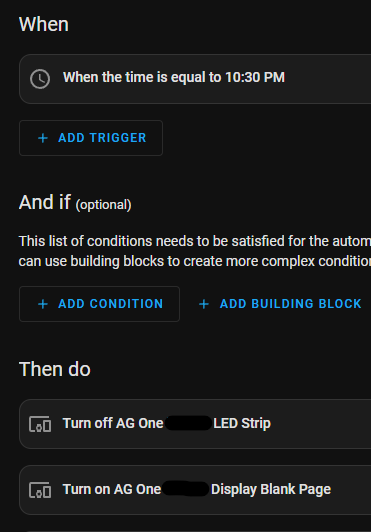

# Configuration

If all original sensors (PMS5003, Senseair S8, SHT4x) are connected, configuration files should be ready for use. To prevent the LED bar from flashing on boot, it is disabled by default.  Once added to Home Assistant, toggle the "LED Strip" switch to enable the bar.

If some sensors are not installed, comment or remove the associated sections under `packages:`

The PMS5003 sensor by default collects readings every second.  Since this device has a limited lifespan, it is possible to extend the life by collecting readings less frequently, although this could impact the accuracy of the readings collected, since there will not be constant airflow through the device when the fan shuts down.  To collect readings every 2 minutes, change the line for the pms5003 sensor to `sensor_pms5003_extended_life.yaml`

> See [PMSX003 Particulate Matter Sensor — ESPHome](https://esphome.io/components/sensor/pmsx003.html#sensor-longevity) for more information

To add your WiFi SSID and password, add your SSID and password information, per ESPHome specifications

```yaml
wifi:
  ssid: NachoWiFi
  password: 123456123456
```

To use IPv6, add the following to the main YAML file for your device

```yaml
network:
    enable_ipv6: true
```

# Modification

### Using local packages

By default, packages are referencing this GitHub repository, allowing you to do a new Install from ESPHome dashboard to get the latest modifications without downloading other files, but does require an Internet connection.  If you wish to have more control over modifications or only reference local files, copy the `packages` folder to your local ESPHome folder in a `packages` subfolder and replace `github://MallocArray/airgradient_esphome/packages `with `!include packages`

```yaml
# Example
board: github://MallocArray/airgradient_esphome/packages/sensor_s8.yaml
# becomes
board: !include packages/sensor_s8.yaml
```

### Using Extend feature

Rather than download an individual package and update the reference to it, you may also use the [Extend](https://esphome.io/guides/configuration-types.html#extend) option to make minor modifications without editing the packages file.  This only works for items with an `id:` defined

> Example: adding this to the main file for your device will change the pin number in the config_button package, while maintaining all other settings defined in the package

```
binary_sensor:
  - id: !extend config_button
    pin:
      number: D7
```

### Copy and Paste

It is also possible to copy the contents of a package file and paste it directly into your YAML file.  Do note that sections cannot be duplicated, so if multiple sections like `interval` are pasted in, they must be combined into a single entry when using this method.

### Adding other packages

Several additional packages are available in the `packages` folder that can be added or removed as needed.  See the [Packages page](/packages.md) for more information about available options.

### Additional Information

MQTT support has been mentioned in the AirGradient forums several times.  ESPHome supports this by adding a few lines to the main yaml file. Add the relevant information for your configuration. Read more about it here:
[https://esphome.io/components/mqtt.html](https://esphome.io/components/mqtt.html)

After extensive discussion on the [AirGradient forum](https://forum.airgradient.com/t/concern-about-hijackable-wifi-connection/3845), it may be a good idea to remove the Captive Portal package after initial configuration, as leaving it in will default to enabling the Access Point Mode if WiFi is not available, potentially allowing an external source to reconfigure the device to a new network or upload another firmware file.  Can also add a password to the ap if this functionality is desired, but want to secure it.

### Using a lolin-d3-mini in an AG Pro board

The lolin-d3-mini has a similar enough pin configuration that we're able to replace the stock D1 mini
and make some minor config changes and get the benefits of an ESP32-c3 based device without buying a
whole new motherboard.

1. Start with the airgradient-pro.yaml file
2. Under packages, replace 'airgradient_d1_mini_board.yaml' with 'airgradient_lolin-c3-mini_board.yaml'
3. change the `!extend config_button` section to use pin number `4` instead of `D7`


# Home Assistant Automation

Pairing ESPHome with Home Assistant opens a multitude of opportunities to create custom actions tailored to your liking.

## Disable Display and LED based on time

Enabling the "Blank Page" switch will disable output on the display.  It is not necessary to turn off any existing pages, and disabling all pages will result in the device rebooting

1. In Home Assistant, navigate to Settings>Automations and scenes
2. Click "Create Automation" button, then "Create new automation"
   1. When
      1. Add Trigger>Time>Mode>Fixed Time
      2. Set to your desired time to turn off the display and/or LED
   2. Then do
      1. Add Action>Device>Select your AirGradient from the ESPHome Integration
      2. In the Action field, select "Turn on `<Your AirGradient Name> Display Blank Page`"
         1. For the base config with only the single page display package, this will set the display to show an empty page
         2. If using the multi_page package, may need to add additional actions to turn off the other enabled pages
      3. Repeat action for "Turn Off `<Your AirGradient Name> LED Strip`" (If applicable)
   3. Click the Save button and give it a name, such as "AirGradient Night Mode"
3. Repeat with a new Automation, with the actions reversed (Turn off Display Blank Page and turn on LED Strip), at the desired time with a name such as "AirGradient Night Mode Off"
   
