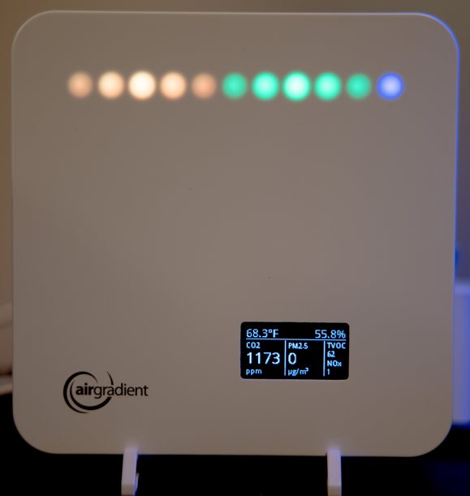

# Packages

This repository is primarily configured around Packages for ESPhome, which are single files that contain all of the related configurations for a particular feature.

## airgradient_api_d1_mini_no_sgp41.yaml

Uploads sensor data to the [AirGradient Dashboard](https://app.airgradient.com/dashboard). This file is for devices based on the D1 Mini chip (AG Basic and AG Pro) that does not include the SGP41 sensor for VOC/NOx

## airgradient_api_d1_mini.yaml

Uploads sensor data to the [AirGradient Dashboard](https://app.airgradient.com/dashboard). This file is for devices based on the D1 Mini chip (AG Basic and AG Pro) with all current sensors, including SGP41

## airgradient_api_esp32-c3_dual_pms5003t.yaml

Uploads sensor data to the [AirGradient Dashboard](https://app.airgradient.com/dashboard). This file is for devices based on the ESP32-C3 chip (AG ONE and OpenAir) with dual PMS5003t sensors.  Designed for the Outdoor OpenAir model O-PPT1

## airgradient_api_esp32-c3.yaml

Uploads sensor data to the [AirGradient Dashboard](https://app.airgradient.com/dashboard). This file is for devices based on the ESP32-C3 chip (AG ONE and OpenAir) with all current sensors for the indoor models

## airgradient_d1_mini_board.yaml

Board configuration for devices based on the D1 Mini chip (AG Basic and AG Pro)

## airgradient_esp32-c3_board.yaml

Board configuration for devices based on the ESP32-C3 chip (AG ONE and OpenAir)

## config_button.yaml

Enables the configuration button on the AirGradient device.  Default configuration is for devices based on ESP32-C3 chip, but additional configuration can be added to change the pin to support D1 Mini if the device has a physical button installed (Already part of the config file for AG Pro v4.2)

```yaml
binary_sensor:
  - id: !extend config_button
    pin:
      number: D7
```

* Short press - Toggle temperature display between C and F
* Press and hold up to 5 seconds - Initiate Senseair S8 CO2 manual calibration.  Ensure device is already outdoors or near an open window for 5+ minutes before initiating

## diagnostic_esp32.yaml

Enables debug sensor information for the ESP32-C3 chip that is very verbose.

## diagnostic_esp8266.yaml

Enables debug sensor information for the ESP8266 (D1 Mini) chip that is very verbose.

## display_sh1106_multi_page.yaml

Display configuration for AG Pro and ONE.  Supports multiple pages that can be rotated through by enabling the switches in the Home Assistant interface

Contrast adjustment is available, which can dim the display considerably, but will not fully disable it

Consumes more RAM than the single page config.  If having trouble with devices, particular the D1 Mini, consider trying the single page configuration instead.

* AirGradient default page
* Summary pages with larger font
* Air quality with only CO2 and PM2.5 values
* Air temp and humidity
* VOC and NOx values
* Combo page with multiple sensor values

## display_sh1106_single_page.yaml

Display configuration for AG Pro and ONE. Displays only a single page based on the default AirGradient look

Contrast adjustment is available, which can dim the display considerably, but will not fully disable it

## display_ssd1306.yaml

Display configuration for AG Basic

## led_co2.yaml

LED bar in AG ONE reflecting multiple sensor values.

Mixes colors from green>yellow>orange>red>purple based on numbers provided by AirGradient.  The values for each color can be modified by adding a substitution section to your config.

```yaml
substitutions:
  co2_green: '400'
  co2_yellow: '1000'
  co2_red: '2000'
  co2_purple: '4000'
```

## led_combo.yaml

LED bar in AG ONE reflecting multiple sensor values. Left 5 LEDs reflect CO2 levels, middle 5 LEDs reflect PM2.5 levels, far right indicates TVOC. (Same as display)

Mixes colors from green>yellow>orange>red>purple based on numbers provided by AirGradient. The values for each color can be modified by adding a substitution section to your config.

```yaml
substitutions:
  co2_green: '400'
  co2_yellow: '1000'
  co2_red: '2000'
  co2_purple: '4000'
  pm_2_5_green: '0'
  pm_2_5_yellow: '11'
  pm_2_5_red: '56'
  pm_2_5_purple: '201'
  voc_green: '100'
  voc_yellow: '150'
  voc_red: '250'
  voc_purple: '400'
  voc_blue: '50'
```

  

## led_pm25.yaml

LED bar in AG ONE reflects PM2.5 levels.

Mixes colors from green>yellow>orange>red>purple based on numbers provided by AirGradient. The values for each color can be modified by adding a substitution section to your config.

```yaml
substitutions:
  pm_2_5_green: '0'
  pm_2_5_yellow: '11'
  pm_2_5_red: '56'
  pm_2_5_purple: '201'
```

## led.yaml

Configures the 11 segment LED bar in AG ONE models.

Also enables On/Off toggle, brightness, and LED fade out

## sensor_nowcast_aqi.yaml

Configures sensors for AQI and NowCast values and Category directly on the device.

Submitted by GitHub user @Ex-Nerd

## sensor_bme680.yaml

Configures sensors from BME 680 chip to supply temperature, humidity, pressure, IAQ, CO2 equivalent, and Breath VOC.

Has not been a reliable source of CO2 or VOC.

## sensor_pms5003_extended_life.yaml

Configures the Plantower PMS5003 sensor.

By default collects readings every second. Since this device has a limited lifespan, it is possible to extend the life by collecting readings less frequently.  Could introduce a new failure mode as the fan shuts down, allowing insects to get inside past the fan that is no longer spinning after 30 seconds.

Collects readings every 2 minutes by default, but can be modifed by adding an entry under substitutions, ensuring the value is surrounded by double quotes
`pm_update_interval: "2min"`

## sensor_pms5003t_2_extended_life.yaml

Configures a second Plantower PMS5003T sensor when 2 are installed, such as the Open Air Model O-1PPT.  Reports PM2.5, Temperature, and Humidity.

Also applies a compensation algorithm from AirGradient to correct temperature and humidity readings when used inside of the Open Air enclosure

In addition to enabling sensors from the second device, also creates sensors that report the average of the 2 devices.

By default collects readings every second. Since this device has a limited lifespan, it is possible to extend the life by collecting readings less frequently.  Could introduce a new failure mode as the fan shuts down, allowing insects to get inside past the fan that is no longer spinning after 30 seconds.

Collects readings every 2 minutes by default, but can be modifed by adding an entry under substitutions, ensuring the value is surrounded by double quotes
`pm_update_interval: "2min"`

## sensor_pms5003t_2.yaml

Configures a second Plantower PMS5003T sensor when 2 are installed, such as the Open Air Model O-1PPT.  Reports PM 2.5, Temperature, and Humidity.

Also applies a compensation algorithm from AirGradient to correct temperature and humidity readings when used inside of the Open Air enclosure

In addition to enabling sensors from the second device, also creates sensors that report the average of the 2 devices.

## sensor_pms5003t_extended_life.yaml

Configures a Plantower PMS5003T sensor.  Reports PM 2.5, Temperature, and Humidity.

Also applies a compensation algorithm from AirGradient to correct temperature and humidity readings when used inside of the Open Air enclosure

By default collects readings every second. Since this device has a limited lifespan, it is possible to extend the life by collecting readings less frequently.  Could introduce a new failure mode as the fan shuts down, allowing insects to get inside past the fan that is no longer spinning after 30 seconds.

Collects readings every 2 minutes by default, but can be modifed by adding an entry under substitutions, ensuring the value is surrounded by double quotes
`pm_update_interval: "2min"`

## sensor_pms5003t_uncorrected.yaml

Configures a Plantower PMS5003T sensor.  Reports PM 2.5, Temperature, and Humidity.

Does not apply a compensation algorithm to provide values directly from the sensor

## sensor_pms5003t.yaml

Configures a Plantower PMS5003T sensor.  Reports PM 2.5, Temperature, and Humidity.

Also applies a compensation algorithm from AirGradient to correct temperature and humidity readings when used inside of the Open Air enclosure

## sensor_pms5003.yaml

Configures a Plantower PMS5003 sensor.

Reports PM 2.5, PM 10, PM 1.0, PM 0.3, and Air Quality Index based on the current readings.

## sensor_s8.yaml

Configures a Senseair S8 sensor.

Reports CO2 levels and enables buttons to initiate a manual baseline correction, show the correction interval, and disable/enable Automatic Baseline Correction feature

Also supports a substitution to introduce an offset to the CO2 readings.  May be helpful if wanting to calibrate to a number different than 400 ppm, or if the sensor is off by a known number.

To your main YAML file, add the following to the substitution section.  Numbers must be surrounded by single quotes and may be positive or negative.

```yaml
substitutions:
  co2_offset: '0'
```

## sensor_sgp41.yaml

Configures a Sensirion SGP41 sensor.

Reports VOC and NOx Index values.

## sensor_sht30.yaml

Configures a Sensirion SHT30 sensor

Reports temperature and humidity

## sensor_sht40.yaml

Configures a Sensirion SHT40 sensor

Reports temperature and humidity

## sensor_uptime.yaml

Configures an Uptime sensor

Reports how long since the last reboot in seconds

## sensor_wifi.yaml

Configures a WiFi sensor

These values are always negative and the closer they are to zero, the better the signal is.

## switch_safe_mode.yaml

Configures a switch to enable Safe Mode

This is useful in certain situations where a misbehaving component, or low memory state is preventing Over-The-Air updates from completing successfully.

## watchdog.yaml

Configures a hardware watchdog for devices that have one installed, such as AG ONE and Open Air

Sends a notification to the watchdog every 2.5 minutes to indicate it is still alive. If not received after ~5 minutes, device will reset
